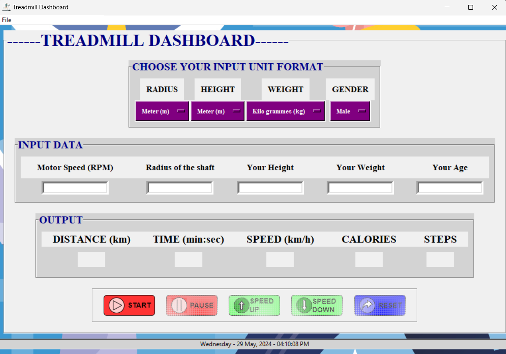

<!DOCTYPE html>
<html lang="en">
<head>
    <meta charset="UTF-8">
    <meta name="viewport" content="width=device-width, initial-scale=1.0">
</head>
<body>

<h1>Treadmill Dashboard</h1>

This project is a Treadmill Dashboard that calculates running speed, distance, burned calories, and the number of steps you run. It also includes a GUI for displaying the inputs and outputs in real-time.

<h2>Features</h2>
<ul>
    <li>Calculates running speed</li>
    <li>Calculates distance traveled</li>
    <li>Calculates burned calories</li>
    <li>Counts the number of steps run</li>
    <li>Real-time display of inputs and outputs</li>
    <li>Adjustable speed during operation</li>
    <li>Reset functionality</li>
</ul>

<h2>How to Use</h2>
<ol>
    <li>Input the unit format and gender.</li>
    <li>Enter the information: rpm (speed), radius, and your height, weight, and age.</li>
    <li>Press the <strong>Start</strong> button to begin the calculations.</li>
    <li>The dashboard starts to calculate the time in real-time.</li>
    <li>Pause to view your outputs.</li>
    <li>Adjust speed using the up and down controls while running.</li>
    <li>Reset the operation if needed.</li>
</ol>

<h2>GUI</h2>

Below is a screenshot of the GUI:

</body>
</html>
